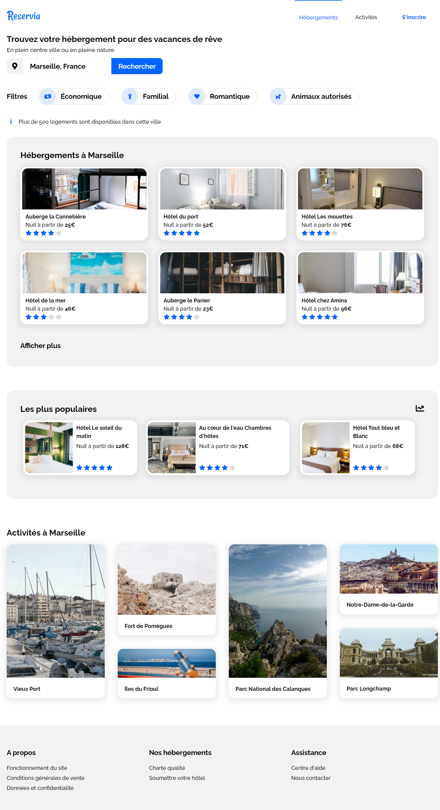
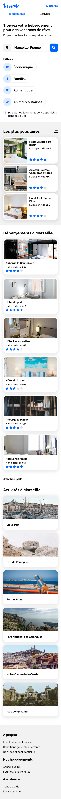

# Reservia
## Second project with Openclassrooms

The goal here was to transform a mockup into a website.

### Specifications

* Users will be able to search for accommodation in the city of their choice. The search field is therefore an input field, the text of which can be edited by the user. 
* Each accommodation or activity card must be clickable in its entirety. 
* The filters must change appearance on hover. I'll let you decide which effect is most appropriate.
* In the menu, the “Accommodation” and “Activities” links are anchors that must lead to the sections of the page.
* The site must be compatible with the latest versions of Chrome and Firefox.
* The HTML and CSS files have to be separated and organize in the folder.

## Technologies

The development will have to be done in  HTML and CSS only.

## Details

#### Font:

Raleway

#### Colors:

Primary: #0065FC / Secondary: #DEEBFF / Tertiary: #F2F2F2.

## Preview 

